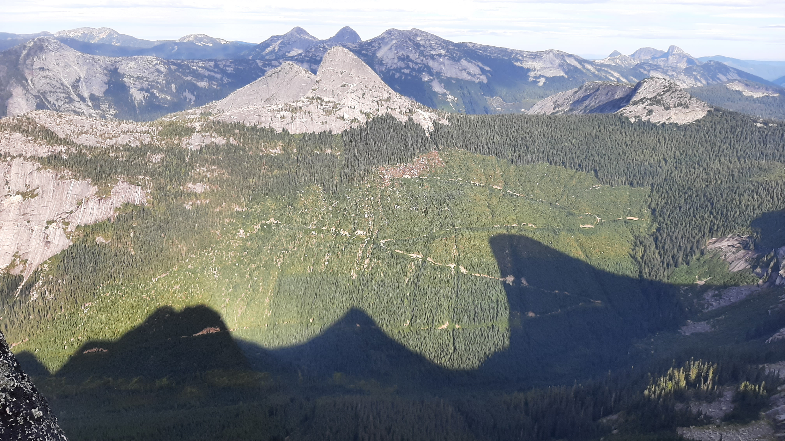
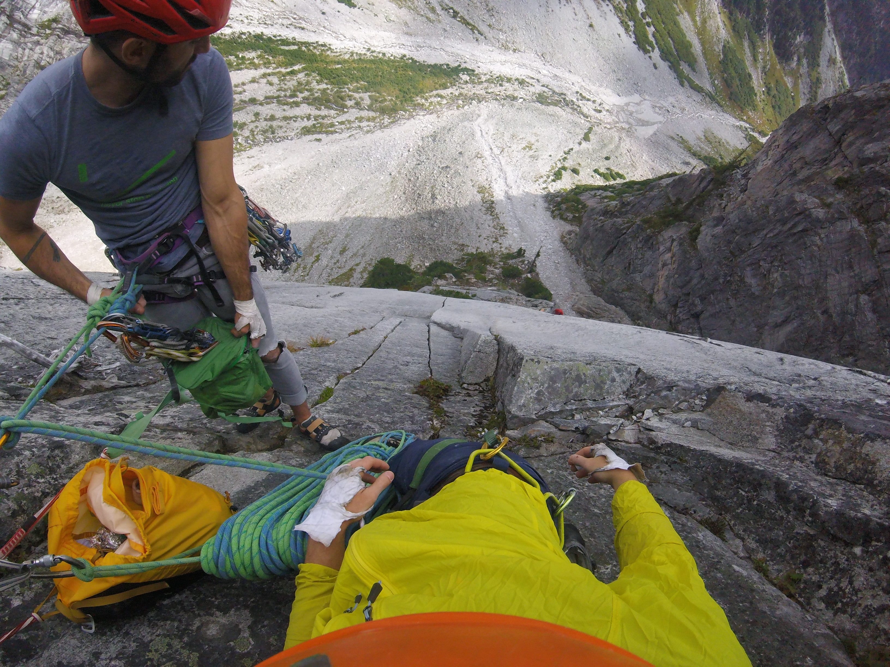

# Alex Weber's Adventure Resume

## Climbing

### Route Development - Traditional Climbs

-   Mashed Bananas 5.10b/c, Golden Canyon, Yukon [2015]{style="float:right"}
-   Sound Travels from the Snow to the Dark 5.10a, Paint Mountain, Yukon [2015]{style="float:right"}

### Alpine Routes

[note: Routes in green are part of the Classic/Updated list of the Fifty Classic Climbs of North America]

-   Springbok Arete 350m IV 13p 5.11a, Anderson Range, Hope, BC [2021]{style="float:right"}\
    

-   Mighty Mouse IV 8p 5.11a, Joffre Creek, BC\
    

-   Sunshine Crack 270m IV 9p 5.11-, Snowpatch Spire, Bugaboos, BC

-   Lotus Flower Tower V 18p 5.11-, The Cirque of the Unclimbables, NWT (only completed 10 pitches due to weather and time constraints)

-   Dairyland 215m 6p 5.10d, Nesakwatch Spires, Chilliwack, BC

-   Paddle Flake Direct 150m III 5p 5.10, Crescent Spire, Bugaboos, BC

-   Direct North Buttress 667m V 21p 5.10-, Bear Mountain, North Cascades, WA

-   Widowmaker Arete 500m 12p 5.10a, North Vancouver, BC

-   Yak Check 450m III 12p 5.10a, Fraser Valley Area, BC

-   Ensawkwatch Enchainment 5km III 18p 5.9, North & South Nesakwatch Spires & Mt. Rexford, Chilliwack, BC

-   Northeast Buttress V 25p 5.9, Slesse Mountain, Chilliwack, BC

-   Escape Velocity 135m 7p 5.9, Mt Habrich, Squamish, BC

-   Northeast Ridge 455m IV 10p 5.9 variation, Bugaboo Spire, Bugaboos, BC

-   NE Buttress 400m 10p 5.6, West Lion, North Vancouver, BC

-   North Ridge 600m III, 5.4, Tricouni, Whistler, BC

-   West Ridge 455m III 5.4 free solo, Pigeon Spire, Bugaboos, BC

### Multi-pitch Rock Climbs

Yankee Clipper 15p sport 5.12a, The Jungle, El Potrero Chico, Mexico Borderline / Angel's Crest / High Plains Drifter 14p trad 5.11c, The Chief, Squamish BC Gulag Archipelago 4p sport 5.11c, Red Wall, Smith Rock, Oregon New Life 5p trad 5.11b, North Walls, Squamish, BC Fogducker trad 4p 5.11a, Slhanay, Squamish, BC Wonderful Thing About Tiggers trad 7 p 5.11a, Fluffy Kitten Wall, Squamish, BC The Grand Wall 9p trad 5.11a A0, The Chief, Squamish, BC Cruel Shoes into Grand Wall 12p trad 5.11a A0, The Chief, Squamish, BC Capilano Classic 3p trad 5.11a, Vancouver, BC Krimo Gold 5p trad 5.11a, The Chief, Squamish, BC Estrallita 12p sport 5.11a, La Estrallas, El Potrero Chico, Mexico Guaranteed Rugged 33p sport 5.10d (on-sight), Marble Canyon, BC, Canada [note: longest multi-pitch sport climb in North America?] (2022) Photophobia 5p trad 5.10d, Slhanay, Squamish BC Pipeline 4p trad 5.10d off-width, Slhanay, Squamish, BC Right Wing 5p trad 5.10d PG13, Slhanay, Squamish, BC The Great Game 4p trad 5.10d (on-sight), Slhanay, Squamish, BC Borderline / Angel's Crest 15p trad 5.10d (red-point), The Chief, Squamish, BC Sunset Strip 12p trad 5.10d, Grand Wall, Squamish, BC Humanality 6p sport 5.10d (on-sight), Tonsai Wall, Railay, Thailand Crystal Flame 4p sport 5.10d (on-sight), Candlestick Area, Railay, Thailand Stairway to Heaven 16p sport 5.10d, Grand Wall, Squamish, BC Rock-On Direct / Ultimate Everything 13p trad 5.10c, The Chief, Squamish, BC St. Vitus' Dance / Karen's Math / Memorial Crack / Squamish Buttress 13p trad 5.10c (on-sight), The Chief, Squamish, BC Bulletheads East 4p trad 5.10c (on-sight), The Chief, Squamish, BC Treasure of Sierra Madres 7p sport 5.10c (on-sight), Mota Wall, El Potrero Chico, Mexico Over the Rainbow (5.10b var.) / Boomstick / Squamish Buttface (5.10a var.) 16p trad 5.10b (on-sight), The Chief, Squamish, BC Black Orpheus 11p trad 5.10a (on-sight), Oak Creek Canyon, Red Rock, Nevada Hairpin 4p trad 5.10a (on-sight), Papoose, Squamish, BC Kor-Ingalls Route 4p 5.9 (on-sight), Castleton Tower, Utah The Nose 28p trad and aid VI 5.9 C2, Yosemite, California, USA - note: fixed to Sickle, climbed over four days and three nights, slept on summit (Oct 2022) Crimson Chrysalis 9p trad 5.8+ (on-sight), Cloud Tower, Red Rock, Nevada Royal Arches 15p III/IV 5.7 A0 (on-sight), Yosemite, California, USA Banana Peel 8p 5.7 PG13 by headlamp, Apron, Squamish, BC

Redpoint - Sport Climbs Lox Stock and Two Smolts on Bagels 5.12a, Paradise Valley, Squamish, BC Princess Eyes 5.11c/d, Phra Nang Beach, Railay, Thailand Knucklehead 5.11c, Knucklehead, Cypress Falls, North Vancouver, BC Stumped 5.11c, Morning Glory, Skaha, BC Swamptart 5.11c, Vinyl Village, Yukon Thumbstruck 5.11b, Grassy Glades, Skaha, BC Desperate Measures 5.11b, McIntyre Bluff, Yukon Pin Heads from Space 5.11b, Rock Gardens, Yukon White on Rice 5.11b, White Mountain, Yukon

On-sight - Sport Climbs Alevin and the Chipmunks 5.11c, Red Wall, Paradise Valley, Squamish, BC Grin and Bear It 5.11c, Doctors' Wall, Skaha, BC Wings of Desire 5.11c, The White Wall, Skaha, BC Wingman 5.11b, Sully's Hangout, Vancouver, BC Thriller Off the Void 5.11b Mixed, Murrin Park, Squamish, BC Being There 5.11b, Morning Glory, Skaha, BC Just Basking 5.11b, Diamondback, Skaha, BC Lightly Toasted 5.11b, Llama Wall, Smith Rock, Oregon The Compromise 5.11b, Rogue's Gallery, Squamish, BC Constant Gardener 5.11b, Sully's Hangout, Vancouver, BC Fuzzy Undercling 5.11b, Military Wall, Red River Gorge, KY Glitter Gulch 5.11b, Sweet Pain Wall, Red Rock, NV Sour Pain 5.11b, Sweet Pain Wall, Red Rock, NV My One Muscle 5.11a, Sully's Hangout, Vancouver, BC Great Grandaddy mixed 5.11a, Murrin Park, Squamish, BC Villainous 5.11a, Morning Glory, Skaha, BC Totally Villainous 5.11a, Morning Glory, Skaha, BC Cytotoxic 5.11a, Diamondback, Skaha, BC Entering Relativity 5.11a, Llama Wall, Smith Rock, Oregon Good Times 5.11a, Fern Hill, Squamish, BC Solitary Confinement 5.11a, Fern Hill, Squamish, BC Lubo 511a, Sully's Hangout, Vancouver, BC Desert Dessert 5.11a, Middle East Wall, Frenchman Coulee, WA Two Pumped Chumps 5.11a, Mota Wall, El Potrero Chico, Mexico Best Route in Minnesota, The 5.11a, Escher World, Railay, Thailand Beauty and the Beast, 5.11a, Tonsai Roof, Railay, Thailand No Name 5.11a, Dum's Kitchen, Railay, Thailand Mutual of Omaha 5.11a, Wild Kingdom, Railay, Thailand Krabi! Krabi! 5.11a, The Defile Wall, Railay, Thailand Muay Thai 5.11a, Muay Thai, Railay, Thailand Kratoy (Lady Boy) 5.11a, One-Two-Three, Railay, Thailand Nut Cracker 5.11a, The Keep, Railay, Thailand Babo Does Thailand 5.11a, The Keep, Railay, Thailand Balance Beam 5.11a, Playground, Red River Gorge, KY Captain Blondie Sinks the Ship 5.11a, Boneyard, Red River Gorge, KY Basqueing in Your Affection 5.11a, Golden Canyon, Yukon Trash Pump 5.11a, White Mountain, Yukon

Redpoint - Traditional Climbs Yorkshire Gripper 5.11b, Smoke Bluffs, Squamish, BC Partners in Crime 5.11a, Smoke Bluffs, Squamish, BC Kangaroo Korner 5.11a, Smoke Bluffs, Squamish, BC Ginger 5.11a, Vinyl Village, Yukon Rainy Day Dream Away 5.10c, Bulletheads, Squamish, BC Coogee Crack 5.10c, Chief, Squamish, BC Thorax Complaint 5.10c, Smoke Bluffs, Squamish, BC Yoga Man 5.10c, McIntyre Creek, Yukon Split Beaver 5.10b (OW), Smoke Bluffs, Squamish, BC

On-sight - Traditional Climbs Climb and Punishment 5.10d, Smoke Bluffs, Squamish, BC Who's Your Daddy? 5.10d Mixed, Nightmare Wall, Squamish, BC Centre Street 5.10c, Smoke Bluffs, Squamish, BC Elephantiasis 5.10c, Smoke Bluffs, Squamish, BC Crossroads 5.10c, Garibaldi Estates, Squamish, BC Where's Carruthers? 5.10c, Scarface, Indian Creek, Utah Sinsemilla 5.10c, Sunshine Wall, Frenchman Coulee, WA Maranatha 5.10c, Bridge Area, New River Gorge, WV Rat Mother Crack 5.10c, Paint Mountain, Yukon Popeye and the Raven 5.10c Mixed, Smoke Bluffs, Squamish, BC Unknown Offwidth 5.10+, Reservoir Wall, Indian Creek, Utah SM's Delight 5.10b, Smoke Bluffs, Squamish, BC White Rabbit 5.10b, Smoke Bluffs, Squamish, BC Bob's Your Uncle 5.10b, Top Shelf, Squamish, BC A Pitch in Time 5.10b, Chief, Squamish, BC Lumberland 5.10b, Smoke Bluffs, Squamish, BC Erica 5.10b, Smoke Bluffs, Squamish, BC Jabberwocky 5.10b, Smoke Bluffs, Squamish, BC Geneside 5.10b, Murrin Park, Squamish, BC Life is Suffering 5.10b, McIntyre Creek, Yukon Fistful of Potash 5.10b Mixed, Wall Street, Moab, Utah Hand Jive 5.10b, Malamute, Squamish, BC Unnamed 5.10, Reservoir Wall, Indian Creek, Utah Cypress Crack, 5.10a, Cougar Crag, Cypress Falls, North Vancouver, BC The Zip, 5.10a, Smoke Bluffs, Squamish, BC Run Life a Thief 5.10a, Smoke Bluffs, Squamish, BC Sex Party 5.10a, Middle East Wall, Frenchman Coulee, WA Agathla Unchained 5.10a, Agathla Tower, Frenchman Coulee, WA Sentry Crack 5.10a, Murrin Park, Squamish, BC Nubile Woman 5.10a, Smoke Bluffs, Squamish, BC Split Decision 5.10a, Shannon Falls, Squamish, BC Flying Circus 5.10a, Smoke Bluffs, Squamish, BC Neat and Cool 5.10a, Smoke Bluffs, Squamish, BC Mercury Vapour 5.10a, Papoose, Squamish, BC Flying Circus 5.10a, Smoke Bluffs, Squamish, BC Crescendo 5.10a, Golden Canyon, Yukon Shark Fin 5.10a, Golden Canyon, Yukon Dr. Carl 5.10-, Reservoir Wall, Indian Creek, Utah

Aid Lost Arrow Spire Tip 2p aid III 5.7 C2, Yosemite, California, USA (Oct 2022) Cannabis Wall C2, first five pitches, Tantalus Wall, Squamish, BC (2022) - [note: slept on G7 portaledge] Cannabis Wall C2, first two pitches, Tantalus Wall, Squamish, BC (2021)

Bouldering Bonspiel V5, Halfway Log Dump, Ontario Fire Breather V5, D&D Boulder, Yukon Pocket Problem V4, Grandwall Boulders, Squamish, BC Face Burster V4, Cypress Mountain, North Vancouver, BC Jenna's Jewelry V4, Kraft Boulders, Red Rock, NV

Ice Climbs Curtain Call 120m WI6, Rampart Creek, AB (second; not clean) - 2020 Ice Nine 95m WI6, Ice Fields Parkway, AB (second; not clean) - 2020 Oh Le Tabernac 60m WI5+, Ice Fields Parkway, AB (second; not clean) - 2020 Weeping Wall, Central Pillar, 180m WI5+, Ice Fields Parkway, AB (second; not clean) - 2017 Carlsberg WI5, Lillooet, BC (lead; not clean) - 2018/2019? The Plum 300m WI5, Pemberton, BC Deeping Wall WI5, Marble Canyon, Lillooet, BC Malignant Mushroom WI5, The Ghost, AB (second; clean) - 2017 Nothing But the Breast 145m WI4+, Dave Thomson Highway, AB - 2020 Good Luck and Bad Dreams 115m M6+ WI4, Dave Thomson Highway, AB (second; not clean)- 2020 Two Minutes for Hooking 140m WI4, Squamish, BC - 2021 Synchronicity 300m WI4, Duffey Lake Road, Lillooet, BC Obsession 2p 55m WI4, Orient Bay, ON Professor Falls III 5p 210m WI4, Banff, AB - 2017 Closet Secrets WI4, Duffey Lake Road, Lillooet, BC Plum-Lite WI4, Pemberton, BC Icy BC 105m WI4, Marble Canyon, Lillooet, BC Louise Falls 115m WI4, Lake Louise, AB (didn't top out; too cold) - 2017 Unnamed FA 20m WI4 - Hanover Lake, Vancouver, BC - 2022 (22km + 1100m elevation in snowshoes) The Column WI4-, Rambles Right, Duffey Lake Road, Lillooet, BC Oregon Jack WI3+ (didn't top out) End of the Line 100m WI3, Dave Thomson Highway, AB - 2020 Mouse Trap 330m WI3, Hope, BC Entropy 120m WI3, Whistler, BC Sunshine 45m WI3, Front Ranges, AB Soleil WI3, Whitehorse Bridal Veil Falls WI3, BC A Scottish Tale WI3, Squamish, BC Picadilly Circus WI3, BC Cherry Ice, Lillooet BC Norvan Falls, Vancouver, BC - 2022

Highline

2022 Lost Arrow Spire, 15m line, did not finish set-up (two man team), Yosemite, California, USA Lighthouse Park, 25m line, 5 steps, West Vancouver, BC Lighthouse Park, solo setup 25m line, West Vancouver, BC 2019 Lighthouse Park, various lines from 25-70m, West Vancouver, BC 2017 Backseat Driver FM, 23m long / 20m high, Cypress Falls, North Vancouver, BC (Independent setup) Original Line 30m long / 200m high, North Gully, The Chief, Squamish, BC (Independent setup. Only managed to walk 5 steps)

Scrambles

2022 Sky Pilot, Squamish, BC 2021 Mt Seymour (1,449) - December Peak 6500 (1964) and some more; 1948m ascent, 25km, 13.75 hrs - August Mt Hanover (1748m) + Deek's Peak (1600m?); 1648m ascent, 33kkm; 13.5 hrs - May Mt Brunswick (1788m); 1588m ascent, 15km; 9 hrs car to car - March 2019 Mt Cathedral (1737m); along with Coliseum Mountain (1,440m) and Mt Burwell (1,540m); 15hrs car to car - August Black Tusk, Whistler, BC 2018 Mt Windsor (1688m); Summer? 2016 Sky Pilot, Squamish, BC - August Eastpost Spire, Bugaboos, BC - late July Cypress Peak, Whistler, BC - July Golden Ears, BC - April

Hiking

2022 Tenquille Lake, 30km, Pemberton, BC - three days (day hike to Ogre Lake on second day) 2020 Cathedral Park: Lakeview Mountain + Boxcar; Diamond Trail; Rim Trail + Grimface Mountain, 70km, Cathedral Provincial Park, BC - 5 days (day hikes on days 2,3 and 4) Three Brothers, 40km, E.C. Manning Park, BC - three days (day hike to Nicomen Lake on second day) Mowich Camp via Skyline Trail from Strawberry Flats, 30km, E.C. Manning Park, BC - two days Rainbow Lake and Hanging Lake, 25km, Callaghan Valley, Whistler, BC - two days 2019 Western Uplands Trail, First Loop, 40km, Algonquin Park, ON - three days with my nephew 2018 First Half of Sunshine Coast Trail, 110km, Sunshine Coast, BC - five days Black Tusk, 40km, Garibaldi Provincial Park, BC - two days 2017 Kalalau Trail, 30k, Kauai, Hawaii - two days Panorama Ridge, 30km, Garibaldi Provincial Park, BC - two days 2015 Chilkoot Trail, 53km, Dyea, Alaska - several days 2014 Grizzly Lake / Divide Lake / Talus Lake, 60km, solo, YT - two days Slim's River West Trail, 60km, solo, YT - two days West Coast Trail, 75km, Vancouver Island, BC - several days 2013 La Cloche Silhouette Trail, Killarney Provincial Park, ON; 80km - 30hrs

Skiing

2022 Claire Kees Hut 2018 Garibaldi Neve Traverse, 40km with 1,750m of ascent - two days

Running

2022 ForeTrails Hallow's Eve, North Vancouver, BC; 21.1k trail race with 866m ascent - 2.5hrs 2019 FatDog 70, Manning Park, BC; 111k trail race with 4,700m of ascent - 20hr Kneeknacker 50, North Vancouver, BC; 48k trail race with 3,000m of ascent - 7hr Howe Sound Crest Trail x2; from Cypress to Deeks Lake and back: 48k solo and unsupported with 4,000m ascent - 13hr Forerunners Super Summit 50k; 1,500m ascent - 6hr Mamquam Lake and back; 46k solo and unsupported with 2,400m ascent - 8hr? Grouse to Mt. Unnecessary and back; 45k solo and unsupported with 2,050m ascent - 7hr 2018 Bear Mountain, Victoria, BC; 10k 2016 Squamish 50, Squamish, BC; 50k trail race with 2,500m of ascent - 7hr 6mins Ironman, Whistler, BC; 3.8km swim, 180km bike, 42.2km run - 12hr 17mins Survival of the Fittest, Squamish, BC; 15k trail race with 1,050m of ascent - 1hr 56mins Vancouver Marathon, Vancouver, BC - 3hr 27mins Cap Crusher, Vancouver BC; 13k trail race with 650m of ascent - 1hr 18mins 2015 Run Ridge Run, Coquitlam, BC; 25k trail race with 1,400m of ascent - 3hr 4mins Klondike Trail of '98 International Road Relay, Skagway, Alaska / Whitehorse Yukon; Leg 5 (22.2km) - 1hr 57mins Yukon River Trail Marathon - 4hr 20mins 2014 Klondike Trail of '98 International Road Relay, Skagway, Alaska / Whitehorse Yukon; Leg 6 (25.6km) - 2hr 11mins 2013 Half Ironman, Muskoka, ON; 1.9km swim, 94km bike, 21.1 km run - 6hr 2mins 2012 Road2Hope Hamilton Marathon, Hamilton, ON - 3hr 28mins Around the Bay Road Race; 30km - 2hr 38mins

Cycling

2021 210km Fixed Gear - Early Bird Special - 210km with 2130m ascent, 8hrs 59mins - Vancouver, BC Triple Crown: 130km with 2600m ascent, 8 hrs? - North Shore, Vancouver, BC 2016 200km Breve - 3 Hump Camel - 8hr ? Pacific Populaire; 100km bike ride on a fixed gear - ? 2015 200km Breve - 10hr ? 2014 Kluane Chilkat International Bike Relay, Haines Junction, YT / Haines, AK; 238.3 km bike race, solo - 11hr 18mins 2013 600km Breve - 34hr 400km Breve - 18hr TNT (Toronto - Niagara Falls - Toronto) Hairshirt Classic Double Century; 320km bike ride - 14hrs 59mins 300km Breve - 17hr 200km Breve - 10hr 160km Hamilton - Toronto - Hamilton; fixed gear bike - ?

Canoeing Powell Forest Canoe Route; 57 km, 8 lakes, 5 portages - 5 days - 2022 Indian Arm - 2 days - 2017/8? Yukon River - Carcross to Dawson - 5 days? 2014/5? Kawartha Lakes - 2 days - 2013 Various multi-day canoe routes in Algonquin
