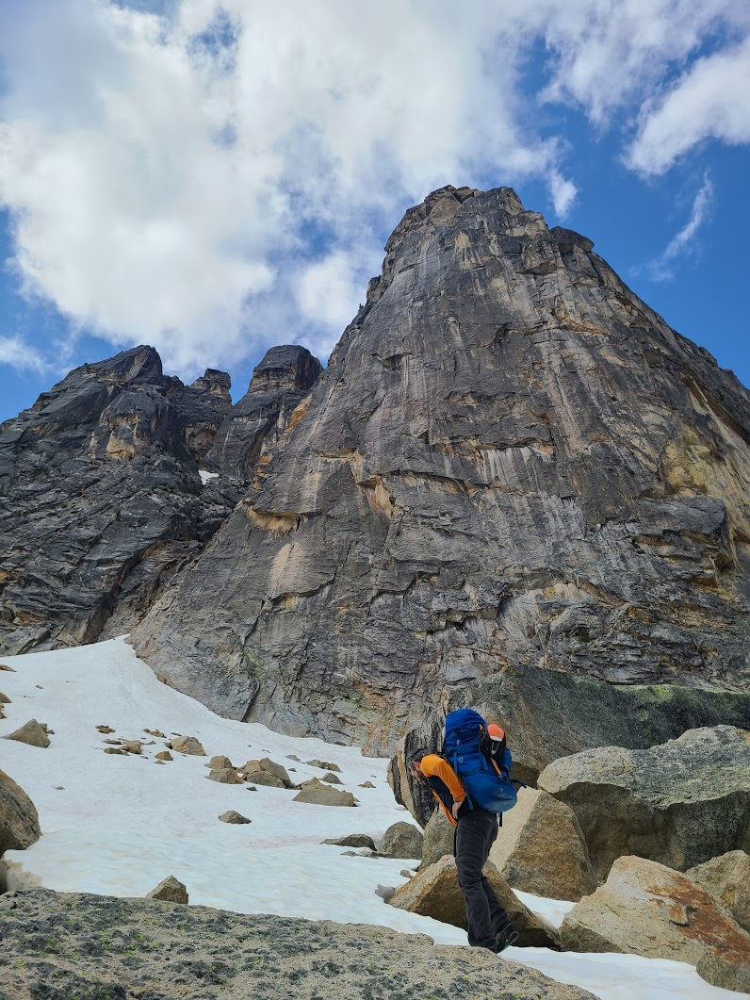
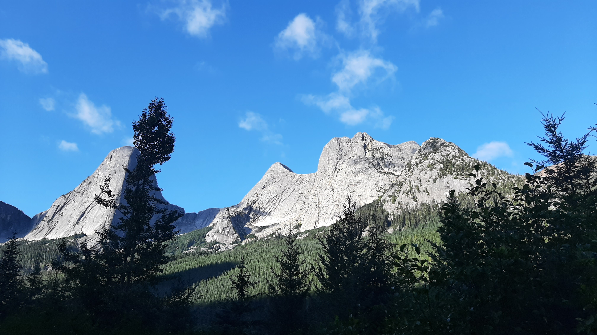
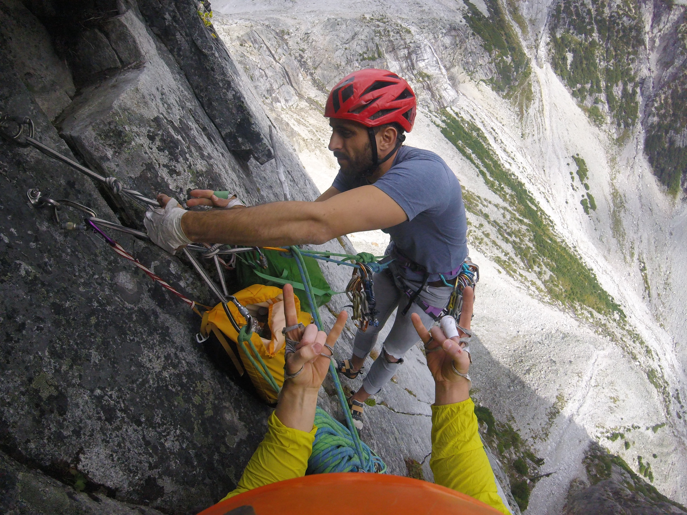
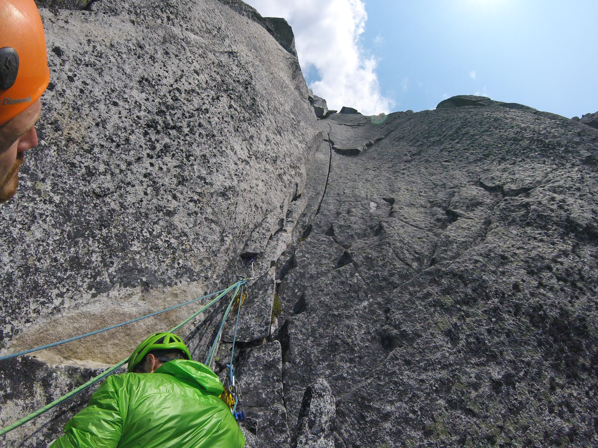
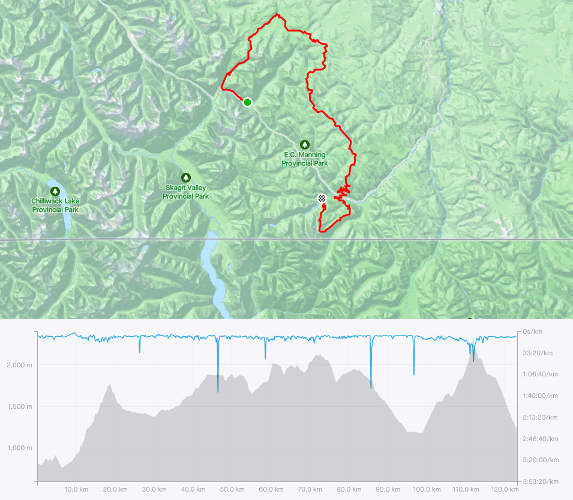

# Rock Climbing

## Route Development - Traditional Climbs

-   [Mashed Bananas](https://www.mountainproject.com/route/109251092/mashed-bananas) 5.10b/c, Golden Canyon, Yukon [2015]{style="float:right"}
-   [Sound Travels from the Snow to the Dark](https://www.mountainproject.com/route/111056768/sound-travels-from-the-snow-to-the-dark) 5.10a, Paint Mountain, Yukon [2015]{style="float:right"}

## Alpine Routes

<mark style="background-color: #AAFF00"> \[note: Routes in green are part of the Classic/Updated list of the [Fifty Classic Climbs of North America](https://en.wikipedia.org/wiki/Fifty_Classic_Climbs_of_North_America)] </mark>

-   <mark style="background-color: #AAFF00"> [Liberty Crack](https://www.mountainproject.com/route/106512297/liberty-crack) 364m V 12p 11a C2, Washington Pass, Washington, USA </mark> [2025]{style="float:right"}\

    

    
    

-   [Springbok Arete](https://www.mountainproject.com/route/114545765/springbok-arete) 350m IV 13p 5.11a, Anderson Range, Hope, BC [2021]{style="float:right"}\
    [[Youtube](https://www.youtube.com/watch?v=YmZ5O80E2TA)]
    

      
Photo

      {width="377"}
    

-   [Mighty Mouse](https://www.mountainproject.com/route/113427644/mighty-mouse) IV 8p 5.11a, Joffre Creek, BC [2019]{style="float:right"}\
    [[Youtube](https://www.youtube.com/watch?v=cW1AR1yDA0I)]\
    

      
Photo

      {width="377"}
    

-   [Sunshine Crack](https://www.mountainproject.com/route/105868170/sunshine-crack) 270m IV 9p 5.11-, Snowpatch Spire, Bugaboos, BC [2016]{style="float:right"}\
    [[Youtube](https://youtu.be/MHT1lKAq8aA?t=190)]\
    

      
Photo

      {width="377"}
    

-   <mark style="background-color: #AAFF00">[Lotus Flower Tower](https://www.mountainproject.com/area/105905652/lotus-flower-tower) V 18p 5.11-, The Cirque of the Unclimbables, NWT [2015]{style="float:right"}\
    [note: only completed 10 pitches due to weather and time constraints]\
    [[Youtube](https://www.youtube.com/watch?v=38pePsJ6wFY)]
    
    

      
Photo

      {width="377"}
    

-   [Dairyland](https://www.mountainproject.com/route/114939903/dairyland) 215m 6p 5.10d, Nesakwatch Spires, Chilliwack, BC [2018]{style="float:right"}
    

      
Photo

      {width="377"}
    

-   [Paddle Flake Direct](https://www.mountainproject.com/route/105869571/paddle-flake-direct) 150m III 5p 5.10, Crescent Spire, Bugaboos, BC [2016]{style="float:right"}
    

      
Photo

      {width="377"}
    

    
-   [Red Dihedral](https://www.mountainproject.com/route/105852183/red-dihedral-aka-yggdrasil) 455m IV 12p 5.10b, The Incredible Hulk, Eastern Sierras, CA [2024]{style="float:right"}
    

      
Photo

      {width="377"}
    

-   [Regular Route](https://www.mountainproject.com/route/105816995/third-pillar-regular-route) 242m III 5p 5.10b, Third Pillar of Dana, Eastern Sierras, CA [2024]{style="float:right"}
    

      
Photo

      {width="377"}
    

-   [Direct North Buttress](https://www.mountainproject.com/route/112828257/direct-north-buttress) 667m V 21p 5.10-, Bear Mountain, North Cascades, WA [2017]{style="float:right"}\
    [[Youtube](https://www.youtube.com/watch?v=0MRtQ1rg4oc)]\
    

      
Photo

      {width="377"}
    

-   [Pup Buttress](https://www.mountainproject.com/route/113544300/pup-buttress) D+ 10-11p 5.10a, Harvey's Pup, North Vancouver, BC [2023]{style="float:right"}\

-   [Widowmaker Arete](https://www.mountainproject.com/route/116522314/widowmaker-arete) 500m 12p 5.10a, Crown Mountain, North Vancouver, BC [[Youtube](https://www.youtube.com/watch?v=RoOyfARGDgo)] [2020]{style="float:right"}

-   [Yak Check](https://www.mountainproject.com/route/106517307/yak-check) 450m III 12p 5.10a, Yak Peak, Fraser Valley Area, BC [[Youtube](https://www.youtube.com/watch?v=ztKkoxCPc-U)] [2016]{style="float:right"}

-   [Ensawkwatch Enchainment](https://www.mountainproject.com/route/113544618/ensawkwatch-enchainment-d) 5km III 18p 5.9 var., North & South Nesakwatch Spires & Mt. Rexford, Chilliwack, BC [[Youtube](https://www.youtube.com/watch?v=RCvaISGolLM)] [2018]{style="float:right"}

-   <mark style="background-color: #AAFF00">[Northeast Buttress](https://www.mountainproject.com/route/106108831/northeast-buttress) V 25p 5.9, Slesse Mountain, Chilliwack, BC [[Youtube](https://www.youtube.com/watch?v=zCY_Sxgihho)] [2017]{style="float:right"}

-   [Escape Velocity](https://www.mountainproject.com/route/111849325/escape-velocity) 135m 7p 5.9-, Mt Habrich, Squamish, BC

-   <mark style="background-color: #AAFF00">[Northeast Ridge](https://www.mountainproject.com/route/105889511/north-east-ridge) 455m IV 10p 5.9 var., Bugaboo Spire, Bugaboos, BC [2015]{style="float:right"}\
    [[Youtube](https://youtu.be/MHT1lKAq8aA?t=17)]

-   [Needs More Cow Bell](https://www.mountainproject.com/route/120812266/needs-more-cowbell) 214m 6p 5.8+, Boxcar Mountain, Cathedral Lakes, BC [2023]{style="float:right"}\

-   [NE Buttress](https://www.mountainproject.com/route/119444837/northeast-buttress) 400m 10p 5.6, West Lion, North Vancouver, BC [[Youtube](https://www.youtube.com/watch?v=Z1a7XdPQ7Zo)] [2020]{style="float:right"}\

-   [North Ridge](https://www.mountainproject.com/route/119050077/north-ridge) 600m III, 5.4, Tricouni, Whistler, BC [2021]{style="float:right"}\
    [[Youtube](https://www.youtube.com/watch?v=Dui82abXbdY)]

-   [West Ridge](https://www.mountainproject.com/route/105869393/west-ridge) 455m III 5.4 free solo, Pigeon Spire, Bugaboos, BC [2015]{style="float:right"}\
    [[Youtube](https://youtu.be/MHT1lKAq8aA?t=138)]

## Multi-pitch Rock Climbs

-   Yankee Clipper 15p sport 5.12a, The Jungle, El Potrero Chico, Mexico [2014]{style="float:right"}\

-   Borderline / Angel's Crest / High Plains Drifter 14p trad 5.11c, The Chief, Squamish BC

-   Gulag Archipelago 4p sport 5.11c, Red Wall, Smith Rock, Oregon [2017]{style="float:right"}

-   New Life 5p trad 5.11b, North Walls, Squamish, BC

-   Fogducker 4p trad 5.11a, Slhanay, Squamish, BC

-   Wonderful Thing About Tiggers 7p trad 5.11a, Fluffy Kitten Wall, Squamish, BC

-   The Grand Wall 9p trad 5.11a A0, The Chief, Squamish, BC

-   Cruel Shoes into Grand Wall 12p trad 5.11a A0, The Chief, Squamish, BC

-   Capilano Classic 3p trad 5.11a, Vancouver, BC

-   Krimo Gold 5p trad 5.11a, The Chief, Squamish, BC

-   Estrallita 12p sport 5.11a, La Estrallas, El Potrero Chico, Mexico [2014]{style="float:right"}\

-   Guaranteed Rugged 33p sport 5.10d (on-sight), Marble Canyon, BC, Canada [2022]{style="float:right"}\
    [note: longest multi-pitch sport climb in North America?]

-   Photophobia 5p trad 5.10d, Slhanay, Squamish BC

-   Pipeline 4p trad 5.10d off-width, Slhanay, Squamish, BC

-   Right Wing 5p trad 5.10d PG13, Slhanay, Squamish, BC

-   The Great Game 4p trad 5.10d (on-sight), Slhanay, Squamish, BC

-   Borderline / Angel's Crest 15p trad 5.10d (red-point), The Chief, Squamish, BC

-   Sunset Strip 12p trad 5.10d, Grand Wall, Squamish, BC [2015]{style="float:right"}

-   Humanality 6p sport 5.10d (on-sight), Tonsai Wall, Railay, Thailand [2015]{style="float:right"}

-   Crystal Flame 4p sport 5.10d (on-sight), Candlestick Area, Railay, Thailand [2015]{style="float:right"}

-   Stairway to Heaven 16p sport 5.10d, Grand Wall, Squamish, BC [2015]{style="float:right"}

-   Rock-On Direct / Ultimate Everything 13p trad 5.10c, The Chief, Squamish, BC

-   St. Vitus' Dance / Karen's Math / Memorial Crack / Squamish Buttress 13p trad 5.10c (on-sight), The Chief, Squamish, BC

-   Bulletheads East 4p trad 5.10c (on-sight), The Chief, Squamish, BC

-   Treasure of Sierra Madres 7p sport 5.10c (on-sight), Mota Wall, El Potrero Chico, Mexico [2014]{style="float:right"}

-   Over the Rainbow (5.10b var.) / Boomstick / Squamish Buttface (5.10a var.) 16p trad 5.10b (on-sight), The Chief, Squamish, BC

-   Black Orpheus 11p trad 5.10a (on-sight), Oak Creek Canyon, Red Rock, Nevada, USA [2016]{style="float:right"}

-   Hairpin 4p trad 5.10a (on-sight), Papoose, Squamish, BC

-   <mark style="background-color: #AAFF00">[Regular Route](https://www.mountainproject.com/route/105847227/regular-route) 303m 12p 5.9 (on-sight), Fairview Dome, Tuolumne Meadows, CA [2024]{style="float:right"}

-   <mark style="background-color: #AAFF00">Kor-Ingalls Route 4p 5.9 (on-sight), Castleton Tower, Utah [2016]{style="float:right"}

-   <mark style="background-color: #AAFF00">The Nose 28p trad and aid VI 5.9 C2, El Capitan, Yosemite, California, USA [2022]{style="float:right"}\
    [note: fixed to Sickle, climbed over four days and three nights, slept on summit]

-   Epinephrine 13p trad 5.9 IV (on-sight), Black Velvet Wall, Red Rock, Nevada, USA [2025]{style="float:right"}

-   Crimson Chrysalis 9p trad 5.8+ (on-sight), Cloud Tower, Red Rock, Nevada, USA [2016]{style="float:right"}

-   Frogland 6p trad 5.8 (on-sight), Black Velvet Wall, Red Rock, USA [2025]{style="float:right"}

-   Tunnel Vision 6p trad 5.7 (on-sight), White Rock, Red Rock, Nevada, USA [2025]{style="float:right"}

-   <mark style="background-color: #AAFF00">Royal Arches 15p III/IV 5.7 A0 (on-sight), Yosemite, California, USA [2022]{style="float:right"}

-   Banana Peel 8p 5.7 PG13 by headlamp, Apron, Squamish, BC

## Redpoint - Sport Climbs

-   Lox Stock and Two Smolts on Bagels 5.12a, Paradise Valley, Squamish, BC

-   Princess Eyes 5.11c/d, Phra Nang Beach, Railay, Thailand [2015]{style="float:right"}

-   Knucklehead 5.11c, Knucklehead, Cypress Falls, North Vancouver, BC

-   Stumped 5.11c, Morning Glory, Skaha, BC

-   Swamptart 5.11c, Vinyl Village, Yukon

-   Thumbstruck 5.11b, Grassy Glades, Skaha, BC

-   Desperate Measures 5.11b, McIntyre Bluff, Yukon

-   Pin Heads from Space 5.11b, Rock Gardens, Yukon

-   White on Rice 5.11b, White Mountain, Yukon

## On-sight - Sport Climbs 

-   [Dans ta face](https://www.mountainproject.com/route/107336971/dans-ta-face) 5.11+, Montagne du Tranchant, Lanaudiere, QC [2019]{style="float:right"}

-   Alevin and the Chipmunks 5.11c, Red Wall, Paradise Valley, Squamish, BC

-   Grin and Bear It 5.11c, Doctors' Wall, Skaha, BC

-   Wings of Desire 5.11c, The White Wall, Skaha, BC

-   Clippity-Doo-Dah 5.11b/c, The Pillary, Squamish, BC [2024]{style="float:right"}

-   Chalant 5.11b, The Pillary, Squamish, BC [2024]{style="float:right"}

-   Wingman 5.11b, Sully's Hangout, Vancouver, BC

-   Thriller Off the Void 5.11b Mixed, Murrin Park, Squamish, BC

-   Being There 5.11b, Morning Glory, Skaha, BC

-   Just Basking 5.11b, Diamondback, Skaha, BC

-   Lightly Toasted 5.11b, Llama Wall, Smith Rock, Oregon [2017]{style="float:right"}

-   The Compromise 5.11b, Rogue's Gallery, Squamish, BC

-   Constant Gardener 5.11b, Sully's Hangout, Vancouver, BC

-   Fuzzy Undercling 5.11b, Military Wall, Red River Gorge, KY

-   Glitter Gulch 5.11b, Sweet Pain Wall, Red Rock, NV [2016]{style="float:right"}

-   Sour Pain 5.11b, Sweet Pain Wall, Red Rock, NV [2016]{style="float:right"}

-   My One Muscle 5.11a, Sully's Hangout, Vancouver, BC

-   Great Grandaddy mixed 5.11a, Murrin Park, Squamish, BC

-   Villainous 5.11a, Morning Glory, Skaha, BC

-   Totally Villainous 5.11a, Morning Glory, Skaha, BC

-   Cytotoxic 5.11a, Diamondback, Skaha, BC

-   Entering Relativity 5.11a, Llama Wall, Smith Rock, Oregon [2017]{style="float:right"}

-   Good Times 5.11a, Fern Hill, Squamish, BC

-   Solitary Confinement 5.11a, Fern Hill, Squamish, BC

-   Lubo 511a, Sully's Hangout, Vancouver, BC

-   Desert Dessert 5.11a, Middle East Wall, Frenchman Coulee, WA

-   Two Pumped Chumps 5.11a, Mota Wall, El Potrero Chico, Mexico [2014]{style="float:right"}

-   Best Route in Minnesota, The 5.11a, Escher World, Railay, Thailand [2015]{style="float:right"}

-   Beauty and the Beast, 5.11a, Tonsai Roof, Railay, Thailand [2015]{style="float:right"}

-   No Name 5.11a, Dum's Kitchen, Railay, Thailand [2015]{style="float:right"}

-   Mutual of Omaha 5.11a, Wild Kingdom, Railay, Thailand [2015]{style="float:right"}

-   Krabi! Krabi! 5.11a, The Defile Wall, Railay, Thailand [2015]{style="float:right"}

-   Muay Thai 5.11a, Muay Thai, Railay, Thailand [2015]{style="float:right"}

-   Kratoy (Lady Boy) 5.11a, One-Two-Three, Railay, Thailand [2015]{style="float:right"}

-   Nut Cracker 5.11a, The Keep, Railay, Thailand [2015]{style="float:right"}

-   Babo Does Thailand 5.11a, The Keep, Railay, Thailand [2015]{style="float:right"}

-   Balance Beam 5.11a, Playground, Red River Gorge, KY

-   Captain Blondie Sinks the Ship 5.11a, Boneyard, Red River Gorge, KY

-   Basqueing in Your Affection 5.11a, Golden Canyon, Yukon

-   Trash Pump 5.11a, White Mountain, Yukon

## Redpoint - Traditional Climbs

-   [Familial Ethics](https://www.mountainproject.com/route/119374007/familial-ethics) 5.11b, Murrin Park, Squamish, BC [2024]{style="float:right"}

-   Yorkshire Gripper 5.11b, Smoke Bluffs, Squamish, BC

-   Werewolves of London 5.11a, Smoke Bluffs, Squamish, BC [2024]{style="float:right"}

-   Partners in Crime 5.11a, Smoke Bluffs, Squamish, BC

-   Kangaroo Korner 5.11a, Smoke Bluffs, Squamish, BC

-   Ginger 5.11a, Vinyl Village, Yukon [2015]{style="float:right"}

-   Rainy Day Dream Away 5.10c, Bulletheads, Squamish, BC

-   Coogee Crack 5.10c, Chief, Squamish, BC

-   Thorax Complaint 5.10c, Smoke Bluffs, Squamish, BC

-   Yoga Man 5.10c, McIntyre Creek, Yukon

-   Split Beaver 5.10b (OW), Smoke Bluffs, Squamish, BC

## On-sight - Traditional Climbs

-   Climb and Punishment 5.10d, Smoke Bluffs, Squamish, BC

-   Who's Your Daddy? 5.10d Mixed, Nightmare Wall, Squamish, BC

-   Centre Street 5.10c, Smoke Bluffs, Squamish, BC

-   Elephantiasis 5.10c, Smoke Bluffs, Squamish, BC

-   Crossroads 5.10c, Garibaldi Estates, Squamish, BC

-   Where's Carruthers? 5.10c, Scarface, Indian Creek, Utah

-   Sinsemilla 5.10c, Sunshine Wall, Frenchman Coulee, WA

-   Maranatha 5.10c, Bridge Area, New River Gorge, WV

-   Rat Mother Crack 5.10c, Paint Mountain, Yukon

-   Popeye and the Raven 5.10c Mixed, Smoke Bluffs, Squamish, BC

-   Unknown Offwidth 5.10+, Reservoir Wall, Indian Creek, Utah

-   A Little Testis 5.10b, Murrin Park, Squamish, BC [2024]{style="float:right"}

-   SM's Delight 5.10b, Smoke Bluffs, Squamish, BC

-   White Rabbit 5.10b, Smoke Bluffs, Squamish, BC

-   Bob's Your Uncle 5.10b, Top Shelf, Squamish, BC

-   A Pitch in Time 5.10b, Chief, Squamish, BC

-   Lumberland 5.10b, Smoke Bluffs, Squamish, BC

-   Erica 5.10b, Smoke Bluffs, Squamish, BC

-   Jabberwocky 5.10b, Smoke Bluffs, Squamish, BC

-   Geneside 5.10b, Murrin Park, Squamish, BC

-   Life is Suffering 5.10b, McIntyre Creek, Yukon

-   Fistful of Potash 5.10b Mixed, Wall Street, Moab, Utah

-   Hand Jive 5.10b, Malamute, Squamish, BC

-   Unnamed 5.10, Reservoir Wall, Indian Creek, Utah

-   Cypress Crack, 5.10a, Cougar Crag, Cypress Falls, North Vancouver, BC

-   The Zip, 5.10a, Smoke Bluffs, Squamish, BC

-   Run Life a Thief 5.10a, Smoke Bluffs, Squamish, BC

-   Sex Party 5.10a, Middle East Wall, Frenchman Coulee, WA

-   Agathla Unchained 5.10a, Agathla Tower, Frenchman Coulee, WA

-   Sentry Crack 5.10a, Murrin Park, Squamish, BC

-   Nubile Woman 5.10a, Smoke Bluffs, Squamish, BC

-   Split Decision 5.10a, Shannon Falls, Squamish, BC

-   Flying Circus 5.10a, Smoke Bluffs, Squamish, BC

-   Neat and Cool 5.10a, Smoke Bluffs, Squamish, BC

-   Mercury Vapour 5.10a, Papoose, Squamish, BC

-   Flying Circus 5.10a, Smoke Bluffs, Squamish, BC

-   Crescendo 5.10a, Golden Canyon, Yukon

-   Shark Fin 5.10a, Golden Canyon, Yukon

-   Dr. Carl 5.10-, Reservoir Wall, Indian Creek, Utah

## Aid

-   [University Wall](https://www.mountainproject.com/route/106509963/university-wall) C2, first 5 pitches, including The Shadow, U-Wall, Squamish, BC [2023]{style="float:right"}\

-   Wrist Twister C2+, first pitch, Tantalus Wall, Squamish, BC - solo [2023]{style="float:right"}\

-   <mark style="background-color: #AAFF00">Lost Arrow Spire Tip 2p aid III 5.7 C2, Yosemite, California, USA [2022]{style="float:right"}

-   Cannabis Wall C2, first five pitches, Tantalus Wall, Squamish, BC [2022]{style="float:right"}\
    [note: slept on G7 portaledge]

-   Cannabis Wall C2, first two pitches, Tantalus Wall, Squamish, BC [2022]{style="float:right"}\

## Bouldering

-   Bonspiel V5, Halfway Log Dump, Ontario

-   Fire Breather V5, D&D Boulder, Yukon

-   Pocket Problem V4, Grandwall Boulders, Squamish, BC

-   Face Burster V4, Cypress Mountain, North Vancouver, BC

-   Jenna's Jewelry V4, Kraft Boulders, Red Rock, NV

# Ice Climbing

-   Curtain Call 120m WI6, Rampart Creek, AB [2020]{style="float:right"}\
    [note: second; not clean]

-   Ice Nine 95m WI6, Ice Fields Parkway, AB [2020]{style="float:right"}\
    [note: second; not clean]

-   Oh Le Tabernac 60m WI5+, Ice Fields Parkway, AB [2020]{style="float:right"}\
    [note: second; not clean]

-   Weeping Wall, Central Pillar, 180m WI5+, Ice Fields Parkway, AB [2017]{style="float:right"}\
    [note: second; not clean]

-   Carlsberg WI5, Lillooet, BC [2018/2019?]{style="float:right"}\
    [note: lead; not clean]

-   Polar Circus 400m WI5, Icefields Parkway, AB  [2022]{style="float:right"}\
    [note: did not finish last 30m due to bad ice]

-   Elliot Left Hand 130m WI5, David Thompson Hwy, AB  [2022]{style="float:right"}\
    [note: lead; not clean]

-   The Plum 300m WI5, Pemberton, BC

-   Deeping Wall WI5, Marble Canyon, Lillooet, BC

-   Malignant Mushroom WI5, The Ghost, AB  [2017]{style="float:right"}\
    [note: second; clean]

-   Nothing But the Breast 145m WI4+, Dave Thomson Highway, AB [2020]{style="float:right"}\

-   Cauthorn-Wilson 240m WI4, Washington Pass, Washington, US [2023]{style="float:right"}\

-   Good Luck and Bad Dreams 115m M6+ WI4, Dave Thomson Highway, AB [2020]{style="float:right"}\
    [note: second; not clean]

-   Night N Gale 150m WI4, Bridge River, BC [2023]{style="float:right"}\

-   Two Minutes for Hooking 140m WI4, Squamish, BC [2021]{style="float:right"}\

-   Synchronicity 300m WI4, Duffey Lake Road, Lillooet, BC

-   Obsession 2p 55m WI4, Orient Bay, ON [2015]{style="float:right"}

-   Professor Falls III 5p 210m WI4, Banff, AB [2017]{style="float:right"}\

-   Closet Secrets WI4, Duffey Lake Road, Lillooet, BC

-   Plum-Lite WI4, Pemberton, BC

-   Icy BC 105m WI4, Marble Canyon, Lillooet, BC

-   Louise Falls 115m WI4, Lake Louise, AB (didn't top out; too cold) [2017]{style="float:right"}\

-   Unnamed FA 20m WI4 - Hanover Lake, Vancouver, BC [2022]{style="float:right"}\
    [note: 22km + 1100m elevation in snowshoes]

-   The Column WI4-, Rambles Right, Duffey Lake Road, Lillooet, BC

-   Oregon Jack WI3+ [note: didn't top out] [2016]{style="float:right"}

-   End of the Line 100m WI3, Dave Thomson Highway, AB [2020]{style="float:right"}\

-   Mouse Trap 330m WI3, Hope, BC [2019]{style="float:right"}

-   Entropy 120m WI3, Whistler, BC [2016]{style="float:right"}

-   Sunshine 45m WI3, Front Ranges, AB [2017]{style="float:right"}

-   Soleil WI3, Whitehorse [2014]{style="float:right"}

-   Bridal Veil Falls WI3, BC [2017]{style="float:right"}

-   A Scottish Tale WI3, Squamish, BC 

-   Picadilly Circus WI3, BC [2017]{style="float:right"}

-   Cherry Ice, Lillooet BC

-   Norvan Falls, Vancouver, BC [2022]{style="float:right"}\

# Highlining

-   Lost Arrow Spire, 15m line, did not finish set-up (two man team), Yosemite, California, USA [2022]{style="float:right"}\

-   Lighthouse Park, 25m line, 5 steps, West Vancouver, BC Lighthouse Park, solo setup 25m line, West Vancouver, BC [2022]{style="float:right"}\

-   Lighthouse Park, various lines from 25-70m, West Vancouver, BC [2019]{style="float:right"}\

-   Backseat Driver FM, 23m long / 20m high, Cypress Falls, North Vancouver, BC (Independent setup) [2017]{style="float:right"}\

-   Original Line 30m long / 200m high, North Gully, The Chief, Squamish, BC (Independent setup. Only managed to walk 5 steps) [2017]{style="float:right"}\

# Scrambling

-   Castle Towers, Garibaldi Park, BC (see [Running](#running))) [2023]{style="float:right"}\

-   Grimface Mountain, Cathedral Park, BC [2023]{style="float:right"}\

-   Sky Pilot, Squamish, BC [2022]{style="float:right"}\

-   Mt Seymour (1,449) [December 2021]{style="float:right"}\

-   Peak 6500 (1964) and some more; 1948m ascent, 25km, 13.75 hrs [August 2021]{style="float:right"}\

-   Mt Hanover (1748m) + Deek's Peak; 2637m ascent, 33km; 9 hrs [May 2021]{style="float:right"}\

-   Mt Brunswick (1788m); 1588m ascent, 15km; 9 hrs car to car [March 2021]{style="float:right"}\

-   Mt Cathedral (1737m); along with Coliseum Mountain (1,440m) and Mt Burwell (1,540m); 15hrs car to car [August 2019]{style="float:right"} 

-   Black Tusk, Whistler, BC [2019]{style="float:right"}\

-   Mt Windsor (1688m) [2018]{style="float:right"}\

-   Sky Pilot, Squamish, BC [August 2016]{style="float:right"}\

-   Eastpost Spire, Bugaboos, BC [late July 2016]{style="float:right"}\

-   Cypress Peak, Whistler, BC [July 2016]{style="float:right"}\

-   Golden Ears, BC [April 2016]{style="float:right"}\

# Hiking

-   Windy Joe to Frosty Mountain Loop, 30km and 1,200m elevation, E.C. Manning Park, BC - one day [2024]{style="float:right"}

-   Rockwall Trail, 54km, Kootenay National Park - four days [2023]{style="float:right"}\

-   Tenquille Lake, 30km, Pemberton, BC - three days (day hike to Ogre Lake on second day) [2022]{style="float:right"}\

-   Cathedral Park: Lakeview Mountain + Boxcar; Diamond Trail; Rim Trail + Grimface Mountain, 70km, Cathedral Provincial Park, BC - 5 days (day hikes on days 2,3 and 4) [2020]{style="float:right"}\

-   Three Brothers, 40km, E.C. Manning Park, BC - three days (day hike to Nicomen Lake on second day) [2020]{style="float:right"} 

-   Mowich Camp via Skyline Trail from Strawberry Flats, 30km, E.C. Manning Park, BC - two days [2020]{style="float:right"}\

-   Rainbow Lake and Hanging Lake, 25km, Callaghan Valley, Whistler, BC - two days [2020]{style="float:right"}\

-   Western Uplands Trail, First Loop, 40km, Algonquin Park, ON - three days with my nephew [2019]{style="float:right"}\

-   First Half of Sunshine Coast Trail, 110km, Sunshine Coast, BC - five days [2018]{style="float:right"}\

-   Black Tusk, 40km, Garibaldi Provincial Park, BC - two days [2018]{style="float:right"}\

-   Kalalau Trail, 30k, Kauai, Hawaii - two days [2017]{style="float:right"}\

-   Panorama Ridge, 30km, Garibaldi Provincial Park, BC - two days [2017]{style="float:right"}\

-   Chilkoot Trail, 53km, Dyea, Alaska - several days [2015]{style="float:right"}\

-   Grizzly Lake / Divide Lake / Talus Lake, 60km, solo, YT - two days [2014]{style="float:right"}\

-   Slim's River West Trail, 60km, solo, YT - two days [2014]{style="float:right"}\

-   West Coast Trail, 75km, Vancouver Island, BC - several days [2014]{style="float:right"}\

-   La Cloche Silhouette Trail, Killarney Provincial Park, ON; 80km - 30hrs [2013]{style="float:right"}\

# Skiing

-   Claire Kees Hut, Whistler, BC [2022]{style="float:right"}
    -   Banana Chute on Fissile Peak 

\newline

-   Heart Strings Couloir, Duffey Lake, BC [2022]{style="float:right"}

-   Garibaldi Neve Traverse, Garibaldi, BC; 40km with 1,750m of ascent - two days [2018]{style="float:right"}\

-   Various backcountry runs in Duffey Lake region, BC [2015 - present]{style="float:right"}

-   Various backcountry runs in Yukon [circa 2014-2015]{style="float:right"}

# Running

Most official race event results can be found on my
[athlinks](https://www.athlinks.com/athletes/562034293/results) profile

-   "Cove to Cove", Deep Cove to Porteau Cove via Vicar Ridge, Paton, Hanes
    Valley, BCMC, Baden Powell, and Howe Sound Crest Trail, North Shore, North
    Vancouver, BC; 80k with 7,300m ascent - 29 hrs [2024]{style="float:right"}\

-   Deep Cove - Seymour Ridge - Paton - Norvan Falls - Baden Powell - Deep Cover, North Shore, North Vancouver, BC; 55k with 3,951m ascent - 13.5 hrs [2024]{style="float:right"}\

-   South Granville - Grouse Grind + Stanley Park - South Granville, Vancouver, BC; 45k with 1,385m ascent - 5.5 hrs [2024]{style="float:right"}\

-   South Granville - North Van Beach + Stanley Park + False Creek - South Granville, Vancouver BC; 41k - 4 hrs [2024]{style="float:right"}\

-   Helm Creek to Castle Towers to Rubble Creek, Garibaldi, BC; 41k with 3,000m ascent - 13 hrs [2023]{style="float:right"}\

-   ForeTrails Hallow's Eve, North Vancouver, BC; 21.1k trail race with 866m ascent - 2.5hrs [2022]{style="float:right"}\

-   FatDog 70, Manning Park, BC; 111k trail race with 4,700m of ascent - 20hr 4mins [2019]{style="float:right"}\

  
Photo

    

-   Kneeknacker 50, North Vancouver, BC; 48k trail race with 3,000m of ascent - 7hr 7mins [2019]{style="float:right"}\

-   Howe Sound Crest Trail x2; from Cypress to Deeks Lake and back: 48k solo and unsupported with 4,000m ascent - 13hr 18mins [2019]{style="float:right"}\

-   Forerunners Super Summit 50k; 1,500m ascent - 5hr 42mins [2019]{style="float:right"}\

-   Mamquam Lake and back; 46k solo and unsupported with 2,400m ascent - 6hr 54mins [2019]{style="float:right"}\

-   Grouse to Mt. Unnecessary and back; 45k solo and unsupported with 2,620m ascent - 6hr 43mins [2019]{style="float:right"}\

-   Bear Mountain, Victoria, BC; 10k with 300m of ascent - 1hr 2mins [2018]{style="float:right"}\

-   Squamish 50, Squamish, BC; 50k trail race with 2,500m of ascent - 7hr 6mins [2016]{style="float:right"}\

-   Ironman, Whistler, BC; 3.8km swim, 180km bike, 42.2km run - 12hr 17mins [2016]{style="float:right"}\

-   Survival of the Fittest, Squamish, BC; 15k trail race with 1,050m of ascent - 1hr 56mins [2016]{style="float:right"}\

-   Vancouver Marathon, Vancouver, BC - 3hr 27mins [2016]{style="float:right"}\

-   Cap Crusher, Vancouver BC; 13k trail race with 650m of ascent - 1hr 18mins [2016]{style="float:right"}\

-   Run Ridge Run, Coquitlam, BC; 25k trail race with 1,400m of ascent - 3hr 4mins [2015]{style="float:right"}\

-   Klondike Trail of '98 International Road Relay, Skagway, Alaska / Whitehorse Yukon; Leg 5 (22.2km) - 1hr 57mins [2015]{style="float:right"}\

-   Yukon River Trail Marathon - 4hr 20mins [2015]{style="float:right"}\

-   Klondike Trail of '98 International Road Relay, Skagway, Alaska / Whitehorse Yukon; Leg 6 (25.6km) - 2hr 11mins [2014]{style="float:right"}\

-   Half Ironman, Muskoka, ON; 1.9km swim, 94km bike, 21.1 km run - 6hr 2mins [2013]{style="float:right"}\

-   Road2Hope Hamilton Marathon, Hamilton, ON - 3hr 28mins [2012]{style="float:right"}\

-   Around the Bay Road Race; 30km - 2hr 38mins [2012]{style="float:right"}\

-   Road2Hope Hamilton Half-Marathon, Hamilton, ON - 1hr 48mins [2011]{style="float:right"}\

# Cycling

-   Early Bird Special - Fixed Gear - 210km with 2130m ascent, 8hrs 59mins - Vancouver, BC [2021]{style="float:right"}

-   Triple Crown: 130km with 2600m ascent, 8hr 37mins - North Shore, Vancouver, BC [2021]{style="float:right"}

-   200km Breve - 3 Hump Camel - 8hr? - BC [2016]{style="float:right"}

-   Pacific Populaire; 100km bike ride on a fixed gear - time? - Vancouver, BC [2016]{style="float:right"}

-   200km Breve - 10hr? - Vancouver, BC [2015]{style="float:right"} 

-   Kluane Chilkat International Bike Relay, Haines Junction, YT / Haines, AK; 238.3 km bike race, solo - 11hr 18mins 2013 [2014]{style="float:right"}

-   600km Breve - 34hr - Ontario [2013]{style="float:right"}

-   400km Breve - 18hr - Ontario [2013]{style="float:right"}

-   TNT (Toronto - Niagara Falls - Toronto) Hairshirt Classic Double Century; 320km bike ride - 14hrs 59mins - Ontario [2013]{style="float:right"}

-   300km Breve - 17hr - Ontario [2013]{style="float:right"}

-   200km Breve - 10hr - Ontario [2013]{style="float:right"}

-   160km Hamilton - Toronto - Hamilton; fixed gear bike - time? - Ontario [2013]{style="float:right"}\

# Canoeing

-   Powell Forest Canoe Route - 57km, 8 lakes, 5 portages - 5 days [2022]{style="float:right"}

-   Indian Arm - 40km - 2 days - [2017]{style="float:right"}

-   Yukon River - Carmacks to Dawson - 420km - 5 days [2015]{style="float:right"}

-   Kawartha Lakes - 2 days [2013]{style="float:right"}

-   Various multi-day canoe routes in Algonquin

# Sailing

-   Skipper for 25ft boats [October 2024]{style="float:right"}

-   Vancouver to Gibson's, overnight [May 2024]{style="float:right"}

-   Basic Coastal Navigation Certificate [April 2024]{style="float:right"}

-   Basic Cruising Certificate [Nov 2023]{style="float:right"}
