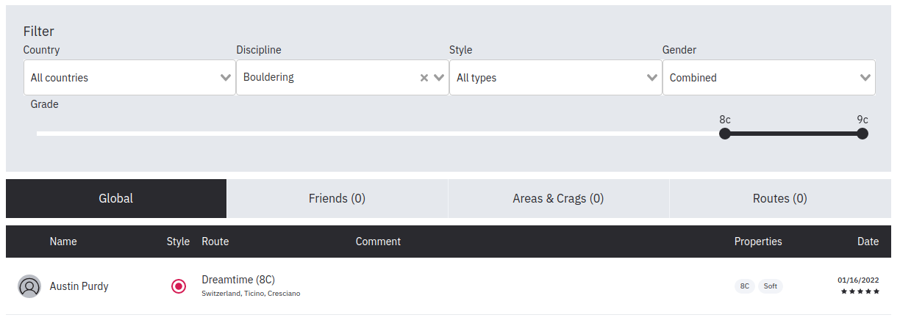

```{r setup, include=FALSE}
knitr::opts_chunk$set(echo = TRUE)
library(tidyr)
library(lubridate)
library(ggplot2)
library(knitr)
require(dplyr) 
library(DT)
#library(kableExtra)
```

**Table of Contents:**<br>
[The World's Hardest Boulder Problems](#the-world-s-hardest-boulder-problems)<br>
[The World’s Current Hardest Boulder Problem](#the-world-s-current-hardest-boulder-problem)<br>
[Who Is the Best Boulderer Ever?](#who-is-the-best-boulderer-ever-)<br>
[Trends Over Time](#trends-over-time)<br>
[How Many People Can Climb V15 or Higher?](#how-many-people-can-climb-v15-or-higher-)<br>
[Which Countries Have the Hardest Boulder Problems?](#which-countries-have-the-hardest-boulder-problems-)<br>


***Last updated:** January 2022. If you notice anything that is an error, or you would like to help improve the list, please let me know.*

*[Note: this site and list are still under construction. Things I still need to do: <br>
- Add ability for users to comment; <br>
- Complete all dates]*

The following is an attempt to update [Alex Beale](https://www.99boulders.com/author/alex)'s fantastic list of [The World's Hardest Boulder Problems](https://www.99boulders.com/hardest-boulder-problems). Alex Beale is [99boulder](https://www.99boulders.com/)'s founder and editor-in-chief. His site attempted to present a table of the hardest boulder problems with a lower cutoff grade of V15 (8C). For problems that did not have a consensus, he came up with a [formulaic way](https://www.99boulders.com/hardest-boulder-problems#list-criteria) to assign one based off the grade suggestions.

As of January 2022, Mr. Beale has not updated the his site past March of 2019. This is really unfortunate as hard bouldering has really exploded starting in 2019 (which I will show below with numbers). The following is my attempt to create the most up-to-date list of hard boulder sends.

```{r, include=FALSE}
mydata <- read.csv("HardBoulders2.csv")
mydata$Date <- format(mdy(mydata$Date), "%m/%d/%Y")
head(mydata)
```

As it stands, there are currently `r nrow(mydata)` entries; of which `r sum(complete.cases(mydata$Date))` have dates.

```{r, echo=FALSE}
uniquebygrade <- mydata %>% count(Grade, Name, sort=TRUE) %>% count(Grade, sort=TRUE)
```

As of this writing, there now appear to be `r uniquebygrade[uniquebygrade$Grade==15.0,]$n` climbs rated **V15 (8C)**, `r uniquebygrade[uniquebygrade$Grade==16.0,]$n` climbs rated **V16 (8C+)**, and `r uniquebygrade[uniquebygrade$Grade==17.0,]$n` climbs rated **V17 (9A)**.

Compared to Alex Beale's list, that is `r uniquebygrade[uniquebygrade$Grade==16.0,]$n - 12` more V16s than there were in March 2019!

```{r, echo=FALSE}
problemcounts15 <- mydata %>% dplyr::filter(Grade == 15.0)
problemcounts15 <- as.data.frame(table(problemcounts15$Route))
problemcounts15 <- problemcounts15 %>% top_n(3,Freq) %>% arrange(desc(Freq))
```
The most climbed **V15** boulder is **`r problemcounts15$Var1[1]`** with `r problemcounts15$Freq[1]` ascents; followed by **`r problemcounts15$Var1[2]`** and **`r problemcounts15$Var1[3]`** with `r problemcounts15$Freq[2]` and `r problemcounts15$Freq[3]` ascents, respectively.

```{r, echo=FALSE}
problemcounts16 <- mydata %>% dplyr::filter(Grade == 16.0)
problemcounts16 <- as.data.frame(table(problemcounts16$Route))
problemcounts16 <- problemcounts16 %>% top_n(3,Freq) %>% arrange(desc(Freq))
```

The most climbed **V16** boulder is **`r problemcounts16$Var1[1]`** with `r problemcounts16$Freq[1]` ascents; followed by **`r problemcounts16$Var1[2]`** and **`r problemcounts16$Var1[3]`** with `r problemcounts16$Freq[2]` and `r problemcounts16$Freq[3]` ascents, respectively.

[Here is a link](https://bit.ly/3FYSddM) to the Google Spreadsheet

# The World's Hardest Boulder Problems

```{r, echo=FALSE}
#kable(mydata[,1:7], caption = "The World’s Hardest Boulder Problems")
DT::datatable(mydata[,1:7], colnames = c('Route Name', 'Climber', 'VGrade', 'FA', 'Country', 'Area', 'Date'), options = list(pageLength = 900, autoWidth = TRUE))
```
# The World’s Hardest Boulder Problem

Based solely on grade, the title of world’s hardest boulder problem is currently shared by two problems: Burden of Dreams and Return of the Sleepwalker. Both are currently graded V17 (9A).

Both problems have only one ascent. Nalle Hukkataival sent Burden of Dreams in October 2016, making it the first problem ever to receive a proposed grade of V17 (9A). Daniel Woods sent Return of the Sleepwalker in March 2021.

Two other problems have been graded V17, to then be downgraded. The Big Island (sit), first climbed by Simon Lorenzi in February 2021 as V17, has since been downgraded by Nico Pelorson in April 2021 (I have given this climb a grade of 16.5). No Kptoe Only, first climbed by Charles Albert (barefoot!) in 2019 as V17, has seen two repeats, with the most recent suggesting a downgrade of V15 (I have recorded the grade as V15 here). 

# Who Is the Best Boulderer Ever?

The following are two bar plots based on the data in the above list showing who has sent the most hard boulder problems and who has put up the most hard boulder first ascents (FAs).

```{r, echo=FALSE}
climbercounts <- table(mydata$Name)
climbercounts <- climbercounts[climbercounts > 12]
ggplot(as.data.frame(climbercounts), aes(x=reorder(Var1, -Freq), y = Freq)) + geom_bar(stat="identity", fill="blue", width=0.5) + geom_text(aes(label=Freq), position=position_dodge(width=0.9), vjust=-0.25, size=3) +
  theme(axis.text.x = element_text(angle = 45, vjust = 1, hjust=1)) + ggtitle("Number of Hard Sends by Climber") +
  labs(y="Number", x = "Climber")
#ggsave("images/NumberbyClimber.png", width = 20, height = 20, units = "cm")
```
```{r, echo=FALSE}
climberFA <- mydata %>% dplyr::filter(FA == "FA")
climberFAcounts <- table(climberFA$Name)
climberFAcounts <- climberFAcounts[climberFAcounts > 7]
ggplot(as.data.frame(climberFAcounts), aes(x=reorder(Var1, -Freq), y = Freq)) + geom_bar(stat="identity", fill="blue", width=0.5) + geom_text(aes(label=Freq), position=position_dodge(width=0.9), vjust=-0.25, size=3) + 
  theme(axis.text.x = element_text(angle = 45, vjust = 1, hjust=1)) + ggtitle("Number of Hard FA Sends by Climber") +
  labs(y="Number", x = "Climber")
#ggsave("images/NumberFAbyClimber.png", width = 20, height = 20, units = "cm")
```
```{r, echo=FALSE}
strongest <- as.data.frame(table(mydata$Name))
strongest <- strongest %>% top_n(3,Freq) %>% arrange(desc(Freq))
strongestFA <- as.data.frame(table(climberFA$Name))
strongestFA <- strongestFA %>% top_n(3,Freq) %>% arrange(desc(Freq))
```

The strongest climber by most hard boulder sends is `r strongest$Var1[1]` with `r strongest$Freq[1]` ascents; `r strongest$Freq[1] - strongest$Freq[2]` more than the `r strongest$Var1[2]` with the second most ascents. However, `r strongestFA$Var1[1]` has the most FAs with `r strongestFA$Freq[1]`; `r strongestFA$Freq[1] - strongestFA$Freq[2]` more than `r strongestFA$Var1[2]`, and an impressive amount of hard sends to his name. Finally, both Daniel Woods and Nalle Hukkataival are the only climbers to have sent a V17.

# Trends Over Time

```{r, echo=FALSE}
#format(as.Date(mydata$Date, format="%m/%d/%Y"),"%Y")
yearcounts <- table(format(as.Date(mydata$Date, format="%m/%d/%Y"),"%Y"))
ggplot(as.data.frame(yearcounts), aes(x=Var1, y = Freq)) + geom_bar(stat="identity", fill="blue", width=0.5) + 
  theme(axis.text.x = element_text(angle = 90, vjust = 0.5, hjust=1)) + ggtitle("Hard Boulder Sends by Year") +
  labs(y="Number", x = "Year")
#ggsave("images/Year.png", width = 20, height = 20, units = "cm")
```

Starting in `r min(na.omit(format(as.Date(mydata$Date, format="%m/%d/%Y"),"%Y")))` with some of the first consensus V15s ([Black Eagle SD](https://climbing-history.org/climb/1143/black-eagle-assis) and [Monkey Wedding](https://climbing-history.org/climb/107/monkey-wedding), both FAs by Fred Nicole; [Dreamtime](https://climbing-history.org/climb/138/dreamtime-(pre-break)) by Fred Nicole was the first V15 in 2000, but was subsequently downgraded to V14...until around 2010 when a hold broke taking it back to V15), there was a consistent year-to-year addition of hard boulders (with the exception of a jump in 2004), only to start growing around 2010. 2013 appears to be a big outlier for some reason (perhaps I have mixed up 2012 and 2013 dates). Finally, starting in 2019, we have a giant explosion in hard boulder sends... 

It took two years from the first suggested V15 (Dreamtime (pre-break)) to a consensus V15 (Black Eagle SD / Monkey Wedding). For V16, the first suggested problem appears to have been Tonino ’78, first sent by Mauro Calibani in 2004. But it wouldn't be until 2016 (12 years later) when Daniel Woods put up [Creature from the Black Lagoon](https://climbing-history.org/climb/1091/creature-from-the-black-lagoon), the world's first consensus V16.

Nalle Hukkataival's [Burden of Dreams](https://climbing-history.org/climb/826/burden-of-dreams), first sent in 2016, has yet to see a repeat to confirm the grade (6 years and counting). Although, I have a sneaky suspicion we will see the first confirmation of a V17 with a repeat of [Return of the Sleepwalker](https://climbing-history.org/climb/1116/return-of-the-sleepwalker) sometime this year...(fingers crossed)

# How Many People Can Climb V15 or Higher?

```{r, echo=FALSE, warning=FALSE}
uniquebygrade <- mydata %>% count(Grade, Name, sort=TRUE) %>% count(Grade, sort=TRUE)
ggplot(uniquebygrade, aes(x=Grade, y = n)) + geom_bar(stat="identity", fill="blue", width=0.3) + 
  geom_text(aes(label=n), position=position_dodge(width=0.9), vjust=-0.25, size=3) + 
  ggtitle("Unique Ascentionists by Grade") +
  labs(y="Number", x = "V Grade")
#ggsave("images/Uniquebygrade.png", width = 20, height = 20, units = "cm")
```
```{r, echo=FALSE}
uniquebygrade <- uniquebygrade %>% arrange(Grade)
```
At the moment, there are more than 200 climbers in the world that have sent V15. After which there is a steep drop off, with `r uniquebygrade[2,2]` unique climbers having sent V15/16, `r uniquebygrade[3,2]` having sent V16, and `r uniquebygrade[4,2]` and `r uniquebygrade[5,2]` having sent V16/17 and V17, respectively.

With hard boulders, downgrading is common, as new climbers come along and find better/easier beta. Nalle wrote a fantastic [blog post](https://nalle-hukkataival.blogspot.com/2010/03/bouldering-grades-everything-is-average.html) back in 2010 giving his thoughts on hard boulder grades.

# Which Countries Have the Hardest Boulder Problems?

```{r, echo=FALSE}
countrycounts <- table(mydata$Country)
countrycounts <- countrycounts[countrycounts > 12]
ggplot(as.data.frame(countrycounts), aes(x=reorder(Var1, -Freq), y = Freq)) + geom_bar(stat="identity", fill="blue", width=0.5) + theme(axis.text.x = element_text(angle = 45, vjust = 1, hjust=1)) +
  ggtitle("Number of Hard Sends by Country") +
  labs(y="Number", x = "Country")
#ggsave("images/NumberbyCountry.png", width = 20, height = 20, units = "cm")
```

The Top 5 Countries with the hardest sends are Switzerland, the United States, France, Japan, and South Africa.

<br />
<br />

*In order to create this list, I first copied Mr. Beale's list. Then, realizing that [scraping](https://github.com/vishaalagartha/8a_scraper) [8a.nu](https://www.8a.nu/) is against their terms of service, I simply clicked on their 'Ascents' tab, clicked 'Bouldering' for the discipline, filtered grades from 8c and higher, and copied the table:*



*However, not all athlete's record their bouldering ascents in 8a.nu (Alex Megos being one example). Another great resource was [https://climbing-history.org/](https://climbing-history.org/), where oftentimes searching for a popular boulder problem would reveal additional sends not listed in 8a.nu.*

*Finally, I then tried to standardize all entries (James Webb vs. Jimmy Webb), remove errors, and add in send dates. Ultimately this is still a work in progress, and if you see any errors, please reach out.*

*Special shout-out to Andrew Leyland for extensive help in filling out the spreadsheet. And for those curious, I used [this tutorial](https://resources.github.com/whitepapers/github-and-rstudio/) to create this site.*
