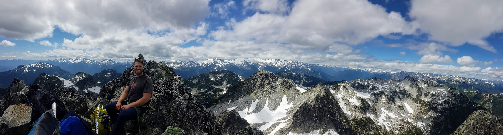

# Alex Weber's Personal Website

Since 2019, Alex has been an Assistant Professor (Partner-Track) at [UBC](https://pediatrics.med.ubc.ca/) and [BC Children's Hospital Research Institute](https://www.bcchr.ca/), interested in using quantitative MRI methods to study and improve brain development in newborns and children.

You can visit his lab's website [here](https://weberlab.github.io/), and see his CV [here](https://docs.google.com/document/d/1MvL-yBm46gM_wIpiVos4WiBYEznQ7gtnVrXooCv2ul0/edit?usp=sharing).

In his spare time, he likes to learn new things and have adventures outside. His main hobbies have been climbing, running, snowboarding, ice climbing, hiking, backcountry camping and more. He hopes to one day learn to sail and paraglide.

